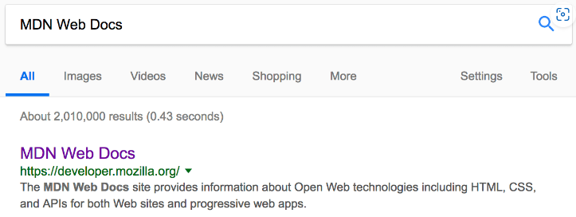
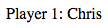
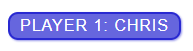
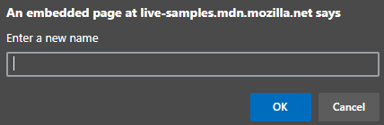
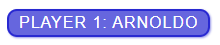

# CF 201 Class 01 Additional Notes

## [Getting Started with the Web](https://developer.mozilla.org/en-US/docs/Learn/Getting_started_with_the_web)

### *Guides*

- Installing basic software
- What will your website look like?
- Dealing with files
- HTML Basics
- CSS Basics
- JavaScript Basics
- Publishing your website
- How the Web Works

___

## [How the Web Works](https://developer.mozilla.org/en-US/docs/Learn/Getting_started_with_the_web/How_the_Web_works)

### *Covered Materials*

- Clients and Servers: The web works on a basic principle of Clients making requests to Servers and Servers sending responses to Cients.
- TCP/IP: Transmission Control Protocol and Internet Protocol.
- DNS: Domain Name System.
- HTTP: Hypertext Transfer Protocol.
- Code Files: HTML, CSS, JavaScript
- Assets: images, music, video, documents

### *Order of Operations*

1. The browser goes to the DNS server, and finds the real address of the server that the website lives on.
2. The browser sends an HTTP request message to the server, asking it to send a copy of the website to the client. This message, and all other data sent between the client and the server, is sent across your internet connection using TCP/IP.
3. If the server approves the client's request, the server sends the client a "200 Ok" message, and then starts sending the website's files to the browser as a series of data packets.
4. The browser assembles the packets to complete the web page.

### *Order which component files are parsed*

1. The browser parses the HTML file first, and that leads the browser recognizing any `<link>` element references to external CSS stylesheets and any ``

Creates a "Hello world!" h1 heading:

- `const myHeading = document.querySelector("h1");`
- `myHeading.textContent = "Hello world!";`
  - Explainer: the function `querySelector()` grabs a reference to the heading, and then stores it in a variable called `myHeading`. This is similar to how CSS selectors work. Meaning, when you want to do something to an element, you need to select it first.
  - Following that, the code set the value of the `myHeading` variable's `textContent` property (which represents the content of the heading) to "Hello world!".

Variables can be created in this manner:

- `let myVariable;`
  - This creates the variabel "myVariable"
- `myVariable = "Bob";`
  - This sets the value of `myVariable` as `"Bob"` which is a string.
- `let myVariable = "Bob";`
  - You can create and assign a value to your variable on the same line.
- `myVariable;`
  - This would retrieve the value by calling the variable name.

### **Data Types**

- String
  - `let myVariable = 'Bob';`
  - `let myVariable = "Bob";`
- Number
  - `let myVariable = 10;`
- Boolean
  - `let myVariable = true;`
- Array
  - `let myVariable = [1, 'Bob', 'Steve', 10];`
  - Refere to each member of the array like this: `myVariable[0]`, `myVariable[1]`
- Object
  - `let myVariable = document.querySelector('h1');`

### **Operators**

- Assignment
  - `=` , assigns a value to a variable.
- Strict equality
  - `===` , tests whether the two values are equal and of the same data type.
- Not, Does-not-equal
  - `!` , `!==` , this returns the logically opposite value of what it preceds.
  - For "Not" the basic expression is `true` but the comparison returns `false`:
    - `let myVariable = 3;`
    - `!(myVariable === 3);`
  - "Does-not-equal" gives basically the same result with different syntax. Here we are testing "is `myVariable` NOT equal to 3". This returns `false` because `myVariable` IS equal to 3:
    - `let myVariable = 3;`
    - `myVariable !== 3;`

### **Conditionals**

Conditionals are code structures used to test if an expression returns true or not. A very common form of conditionals is the if...else statement. For example:

    let iceCream = "chocolate";
    if (iceCream === "chocolate") {
      alert("Yay, I love chocolate ice cream!");
    } else {
      alert("Awwww, but chocolate is my favorite…");
    }

### **Functions**

Functions are a way of packaging functionality that you wish to reuse. It's possible to define a body of code as a function that executes when you call the function name in your code. This is a good alternative to repeatedly writing the same code. You have already seen some uses of functions. For example:

    let myVariable = document.querySelector("h1");
    alert("hello!");

### **Events**

Real interactivity on a website requires event handlers. These are code structures that listen for activity in the browser, and run code in response. The most obvious example is handling the click event, which is fired by the browser when you click on something with your mouse. To demonstrate this, enter the following into your console, then click on the current webpage:

    document.querySelector("html").addEventListener("click", function () {
      alert("Ouch! Stop poking me!");
    });

### **Adding an image changer**

In this section, you will learn how to use JavaScript and DOM API features to alternate the display of one of two images. This change will happen as a user clicks the displayed image.

1. Choose an image you want to feature on your example site. Ideally, the image will be the same size as the image you added previously, or as close as possible.
2. Save this image in your images folder.
3. Rename the image firefox2.png.
4. Add the following JavaScript code to your main.js file.

*Code Examples:*

    const myImage = document.querySelector("img");

    yImage.onclick = () => {
      const mySrc = myImage.getAttribute("src");
      if (mySrc === "images/firefox-icon.png") {
        myImage.setAttribute("src", "images/firefox2.png");
      } else {
        myImage.setAttribute("src", "images/firefox-icon.png");
      }
    };

### **Adding a personalized welcome message**

Heres how this can be done via `querySelector` and `eventListener`

- In index.html, add the following line just before the `

___

### [How do I start to design my website?](https://developer.mozilla.org/en-US/docs/Learn/Common_questions/Design_and_accessibility/Thinking_before_coding)

Find the Why & the What, the develp the How.
___

### [Semantics](https://developer.mozilla.org/en-US/docs/Glossary/Semantics)

Semantics in programming: Semantics refers to the meaning of a piece of code — for example "what effect does running that line of JavaScript have?", or "what purpose or role does that HTML element have" (rather than "what does it look like?".)

Semantics in JavaScript: Consider a function that takes a string parameter, and returns an `<li>` element with that string as its `textContent`. Would you need to look at the code to understand what the function did if it was called `build('Peach')`, or `createLiWithContent('Peach')`?

Semantics in CSS: Consider styling a list with `li` elements representing different types of fruits. Would you know what part of the DOM is being selected with `div > ul > li`, or `.fruits__item`?

Semantics in HTML: for example, the h1 element is a semantic element, which gives the text it wraps around the role (or meaning) of "a top level heading on your page."

    <h1>This is a top level heading</h1>

By default, most browser's user agent stylesheet will style an h1 with a large font size to make it look like a heading (although you could style it to look like anything you wanted).

On the other hand, you could make any element look like a top level heading. Consider the following:

    Not a top-level heading!

## Semantic Elements

### Main Root

| Element |      Description        |
|---------|-------------------------|
| `<html>`|Represents the root (top-level element) of an HTML document, so it is also referred to as the root element. All other elements must be descendants of this element.|

### Document Meta-Data

| Element |      Description        |
|---------|-------------------------|
|`<base>`|Specifies the base URL to use for all relative URLs in a document. There can be only one such element in a document.|
|`<head>`|Contains machine-readable information (metadata) about the document, like its title, scripts, and style sheets.|
|`<link>`|Specifies relationships between the current document and an external resource. This element is most commonly used to link to CSS, but is also used to establish site icons (both "favicon" style icons and icons for the home screen and apps on mobile devices) among other things.|
|`<meta>`|Represents metadata that cannot be represented by other HTML meta-related elements, like `<base>`, `<link>`, `

4. Now we'll add some JavaScript inside our `

3. Inside `script.js`, add the following script:

        function createParagraph() {
          const para = document.createElement("p");
          para.textContent = "You clicked the button!";
          document.body.appendChild(para);
        }

        const buttons = document.querySelectorAll("button");

        for (const button of buttons) {
          button.addEventListener("click", createParagraph);
        }

4. Save and refresh your browser, and you should see the same thing! It works just the same, but now we've got our JavaScript in an external file. This is generally a good thing in terms of organizing your code and making it reusable across multiple HTML files. Plus, the HTML is easier to read without huge chunks of script dumped in it.

### Using addEventListener instead

Instead of including JavaScript in your HTML, use a pure JavaScript construct. The `querySelectorAll()` function allows you to select all the buttons on a page. You can then loop through the buttons, assigning a handler for each using `addEventListener()`. The code for this is shown below:

    const buttons = document.querySelectorAll("button");
    
    for (const button of buttons) {
      button.addEventListener("click", createParagraph);
    }

This might be a bit longer than the `onclick` attribute, but it will work for all buttons — no matter how many are on the page, nor how many are added or removed. The JavaScript does not need to be changed.

**Note:** *Try editing your version of* `apply-javascript.html` *and add a few more buttons into the file. When you reload, you should find that all of the buttons when clicked will create a paragraph. Neat, huh?*

**Note:** *In the external case, we did not need to use the* `DOMContentLoaded` *event because the* `defer` *attribute solved the problem for us. We didn't use the* `defer` *solution for the internal JavaScript example because* `defer` *only works for external scripts.*

___
