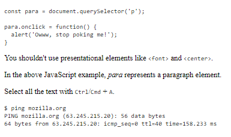

# Basics of HTML, CSS & JS

## Advanced HTML Text Formatting

Headings are simply just pre-formatted section splitters. The number `h1` through `h6`.
`h1` is the main heading, `h2` is subheadings, `h3` are sub-headings.

***Structural Hierarchy Example***

    <h1>The Crushing Bore</h1>
        
By Chris Mills

    <h2>Chapter 1: The dark night</h2>
      

        It was a dark night. Somewhere, an owl hooted. The rain lashed down on the…
      

    <h2>Chapter 2: The eternal silence</h2>
      
Our protagonist could not so much as a whisper out of the shadowy figure…

    <h3>The specter speaks</h3>
      

        Several more hours had passed, when all of a sudden the specter sat bolt
        upright and exclaimed, "Please have mercy on my soul!"
      

### Why use Span?

    
      Is this a top level heading?
    

This is a `` element. It has no semantics. You use it to wrap content when you want to
apply CSS to it (or do something to it with JavaScript) without giving it any extra meaning.
(You'll find out more about these later on in the course.) We've applied some CSS to it
to make it look like a top level heading, but since it has no semantic value, it will
not get any of the extra benefits described above. It is a good idea to use the relevant
HTML element for the job.

## *Lists*

### *Unordered*

Unordered lists use the `<ul>` element wrapped around all entirety of the list. `<li>` is
wrapped around each individual item:

    <ul>
      <li>milk</li>
      <li>eggs</li>
      <li>bread</li>
      <li>hummus</li>
    </ul>

### *Ordered*

    <ol>
      <li>Drive to the end of the road</li>
      <li>Turn right</li>
      <li>Go straight across the first two roundabouts</li>
      <li>Turn left at the third roundabout</li>
      <li>The school is on your right, 300 meters up the road</li>
    </ol>

***Nested Lists***

    <ol>
      <li>Remove the skin from the garlic, and chop coarsely.</li>
      <li>Remove all the seeds and stalk from the pepper, and chop coarsely.</li>
      <li>Add all the ingredients into a food processor.</li>
      <li>
        Process all the ingredients into a paste.
        <ul>
          <li>
            If you want a coarse "chunky" hummus, process it for a short time.
          </li>
          <li>If you want a smooth hummus, process it for a longer time.</li>
        </ul>
      </li>
    </ol>

## Emphasis and Importance

***Emphasis*** the `<em>` tag: works with accessibility features (voice readers). This
displays the text as italic, however, don't use it purely for that. Perhaps use `` or
`<i>` for that. `<em>` can be used to accomplish more.

***Strong*** the `<strong>` tag: similar to `<em>` it changes the on screen text (to bold)
but has other implications in terms of accessibility. To purely use bold styling use
`` or `<b>`.

### Italic, bold, underline…

The elements we've discussed so far have clearcut associated semantics. The situation
with `<b>`, `<i>`, and `<u>` is somewhat more complicated. They came about so people could
write bold, italics, or underlined text in an era when CSS was still supported poorly
or not at all. Elements like this, which only affect presentation and not semantics, are
known as presentational elements and should no longer be used because, as we've
seen before, semantics is so important to accessibility, SEO, etc.

HTML5 redefined `<b>`, `<i>`, and `<u>` with new, somewhat confusing, semantic roles.

Here's the best rule you can remember: It's only appropriate to use `<b>`, `<i>`, or `<u>` to
convey a meaning traditionally conveyed with bold, italics, or underline when there isn't
a more suitable element; and there usually is. Consider whether `<strong>`, `<em>`, `<mark>`,
 or `` might be more appropriate.

Always keep an accessibility mindset. The concept of italics isn't very helpful to people using screen readers, or to people using a writing system other than the Latin alphabet.

`<i>` is used to convey a meaning traditionally conveyed by italic: foreign words,
taxonomic designation, technical terms, a thought…
`<b>` is used to convey a meaning traditionally conveyed by bold: keywords, product
 names, lead sentence…
`<u>` is used to convey a meaning traditionally conveyed by underline: proper name,
 misspelling…

## Other Examples: Scientific, Foreign Language, Misspelling, Definitions

    <!-- scientific names -->
    

      The Ruby-throated Hummingbird (<i>Archilochus colubris</i>) is the most common
      hummingbird in Eastern North America.
    

    <!-- foreign words -->
    

      The menu was a sea of exotic words like <i lang="uk-latn">vatrushka</i>,
      <i lang="id">nasi goreng</i> and <i lang="fr">soupe à l'oignon</i>.
    

    <!-- a known misspelling -->
    
Someday I'll learn how to <u class="spelling-error">spel</u> better.

    <!-- term being defined when used in a definition -->
    <dl>
      <dt>Semantic HTML</dt>
      <dd>
        Use the elements based on their <b>semantic</b> meaning, not their
        appearance.
      </dd>
    </dl>

___

### ***Description Lists***

Description lists use a different wrapper than the other list types -- `<dl>`; in addition
each term is wrapped in a `<dt>` (description term) element, and each description is
wrapped in a `<dd>`.

*Example*: Note that the finale `<dt>` has multiple descriptions.

    <dl>
      <dt>soliloquy</dt>
      <dd>
        In drama, where a character speaks to themselves, representing their inner
        thoughts or feelings and in the process relaying them to the audience (but
        not to other characters.)
      </dd>
      <dt>monologue</dt>
      <dd>
        In drama, where a character speaks their thoughts out loud to share them
        with the audience and any other characters present.
      </dd>
      <dt>aside</dt>
      <dd>
        In drama, where a character shares a comment only with the audience for
        humorous or dramatic effect. This is usually a feeling, thought, or piece of
        additional background information.
      </dd>
      <dd>
        In writing, a section of content that is related to the current topic, but
        doesn't fit directly into the main flow of content so is presented nearby
        (often in a box off to the side.)
      </dd>
    </dl>

## *Quotations*

### ***Blockquotes***

If a section of ablock level content (paragraph, or multiple paragraphs, a list, etc...) is
quoted from somewhere else, you should wrap it inside a `<blockquote>` element to
signify this, and include a URL pointing to the source of the quote inside a `cite`
attribute. The following markup is taken from the MDN `<blockquote>` element page.

    

      The <strong>HTML <code>&lt;blockquote&gt;</code> Element</strong> (or
      <em>HTML Block Quotation Element</em>) indicates that the enclosed text is an
      extended quotation.
    

To turn this into a block quote:

    
Here is a blockquote:

    <blockquote
      cite="https://developer.mozilla.org/en-US/docs/Web/HTML/Element/blockquote">
      

        The <strong>HTML <code>&lt;blockquote&gt;</code> Element</strong> (or
        <em>HTML Block Quotation Element</em>) indicates that the enclosed text is
        an extended quotation.
      

    </blockquote>

### ***Inline Quotations***

Inline quotations work exactly the same with the `<q>` element.

    

      The quote element — <code>&lt;q&gt;</code> — is
      <q cite="https://developer.mozilla.org/en-US/docs/Web/HTML/Element/q">
        intended for short quotations that don't require paragraph breaks.
      </q>
    

### ***Citations***

The content of the `cite` attribute cannot be linked (downside):

    

      According to the
      <a href="/en-US/docs/Web/HTML/Element/blockquote">
        <cite>MDN blockquote page</cite></a>:
    

    <blockquote
      cite="https://developer.mozilla.org/en-US/docs/Web/HTML/Element/blockquote">
      

        The <strong>HTML <code>&lt;blockquote&gt;</code> Element</strong> (or
        <em>HTML Block Quotation Element</em>) indicates that the enclosed text is
        an extended quotation.
      

    </blockquote>

    

      The quote element — <code>&lt;q&gt;</code> — is
      <q cite="https://developer.mozilla.org/en-US/docs/Web/HTML/Element/q">
        intended for short quotations that don't require paragraph breaks.
      </q>
      — <a href="/en-US/docs/Web/HTML/Element/q"><cite>MDN q page</cite></a>.
    

Citations are italic by default.

## *Abbreviations*

`<abbr>` is the abbreviation element. Used to wrap abbreviations or acronyms. Then provide
full expansion of the term in plain text on the first use.

*Example*

    

      We use <abbr>HTML</abbr>, Hypertext Markup Language, to structure our web
      documents.
    

    

      I think <abbr title="Reverend">Rev.</abbr> Green did it in the kitchen with
      the chainsaw.
    

Looks like:

## *Contact Details*

    <address>
      

        Chris Mills 
        Manchester 
        The Grim North 
        UK
      

      <ul>
        <li>Tel: 01234 567 890</li>
        <li>Email: me@grim-north.co.uk</li>
      </ul>
    </address>

*Also this works:*

    <address>
      Page written by <a href="../authors/chris-mills/">Chris Mills</a>.
    </address>

**Note:** *The* `<address>` *element should only be used to provide contact information
for the document contained with the nearest* `<article>` *or* `<body>` *element. It would be
correct to use it in the footer of a site to include the contact information of the entire
site, or inside an article for the contact details of the author, but not to mark up a list
of addresses unrelated to the content of that page.*

### ***Superscript and Subscript***

`` : superscripts; `` : subscripts

    
My birthday is on the 25th of May 2001.

    

      Caffeine's chemical formula is
      C8H10N4O2.
    

    
If x2 is 9, x must equal 3 or -3.

The output of this code looks like so:

## **Representing Computer Code**

`<code>`: For marking up generic pieces of computer code.
`<pre>`: For retaining whitespace (generally code blocks) — if you use indentation or excess
whitespace inside your text, browsers will ignore it and you will not see it on your
rendered page. If you wrap the text in `<pre>``</pre>` tags however, your whitespace will
be rendered identically to how you see it in your text editor.
`<var>`: For specifically marking up variable names.
`<kbd>`: For marking up keyboard (and other types of) input entered into the computer.
`<samp>`: For marking up the output of a computer program.

    <pre><code>const para = document.querySelector('p');

    para.onclick = function() {
      alert('Owww, stop poking me!');
    }</code></pre>

    

      You shouldn't use presentational elements like <code>&lt;font&gt;</code> and
      <code>&lt;center&gt;</code>.
    

    

      In the above JavaScript example, <var>para</var> represents a paragraph
      element.
    

    
Select all the text with <kbd>Ctrl</kbd>/<kbd>Cmd</kbd> + <kbd>A</kbd>.

    <pre>$ <kbd>ping mozilla.org</kbd>
    <samp>PING mozilla.org (63.245.215.20): 56 data bytes
    64 bytes from 63.245.215.20: icmp_seq=0 ttl=40 time=158.233 ms</samp></pre>

## Marking up Time and Date

HTML also provides the `<time>` element for marking up times and dates in a machine-readable
format. For example:

    <time datetime="2016-01-20">20 January 2016</time>

But these different forms cannot be easily recognized by computers — what if you wanted
to automatically grab the dates of all events in a page and insert them into a calendar?
The `<time>` element allows you to attach an unambiguous, machine-readable time/date
for this purpose.

The basic example above just provides a simple machine readable date, but there are many
other options that are possible, for example:

    <!-- Standard simple date -->
    <time datetime="2016-01-20">20 January 2016</time>
    <!-- Just year and month -->
    <time datetime="2016-01">January 2016</time>
    <!-- Just month and day -->
    <time datetime="01-20">20 January</time>
    <!-- Just time, hours and minutes -->
    <time datetime="19:30">19:30</time>
    <!-- You can do seconds and milliseconds too! -->
    <time datetime="19:30:01.856">19:30:01.856</time>
    <!-- Date and time -->
    <time datetime="2016-01-20T19:30">7.30pm, 20 January 2016</time>
    <!-- Date and time with timezone offset -->
    <time datetime="2016-01-20T19:30+01:00">
      7.30pm, 20 January 2016 is 8.30pm in France
    </time>
    <!-- Calling out a specific week number -->
    <time datetime="2016-W04">The fourth week of 2016</time>

___

# Applying CSS to HTML

## External Stylesheet

An external stylesheet contains CSS in a separate file with a `.css` extension. Within an
HTML document `<!DOCTYPE html>` it is referenced from a `<link>` element.

    <!DOCTYPE html>
    <html lang="en-GB">
      <head>
        <meta charset="utf-8" />
        <title>My CSS experiment</title>
        <link rel="stylesheet" href="styles.css" />
      </head>
      <body>
        <h1>Hello World!</h1>
        
This is my first CSS example

      </body>
    </html>

The CSS stylesheet file might look like this:

    h1 {                      //makes style changes to `<h1>` elements
      color: blue;
      background-color: yellow;
      border: 1px solid black;
    }

    p {                       //makes style changes to `
` elements
      color: red;
    }

The `href` attribute of the `<link>` element needs to reference a file in your file system.

    <!-- Inside a subdirectory called styles inside the current directory -->
    <link rel="stylesheet" href="styles/style.css" />

    <!-- Inside a subdirectory called general, which is in a subdirectory called styles, inside the current directory -->
    <link rel="stylesheet" href="styles/general/style.css" />

    <!-- Go up one directory level, then inside a subdirectory called styles -->
    <link rel="stylesheet" href="../styles/style.css" />

## Internal Stylesheet

This is when your stylesheet is within your `<!DOCTYPE html>` HTML Document within the `<head>`

    <!DOCTYPE html>
    <html lang="en-GB">
      <head>
        <meta charset="utf-8" />
        <title>My CSS experiment</title>
        
      </head>
      <body>
        <h1>Hello World!</h1>
        
This is my first CSS example

      </body>
    </html>

***Avoid using CSS in this manner when possible.***

## Selectors

a ***selector*** targets HTML to apply styles to content. Each CSS rule starts with a selector or a list
of selectors in order to tell the browser which element(s) the rules should apply to. All the examples below
are valid selectors or lists of selectors.

    h1
    a:link
    .manythings
    #onething
    *
    .box p
    .box p:first-child
    h1, h2, .intro

### *Specificity*

Consider the following stylesheet: with a `p` selector that sets paragraph text to blue. However, there is 
also a class that sets the text of the selected elements to red.

    .special {
      color: red;
    }

    p {
      color: blue;
    }

Suppose that in the HTML of our document, we have a paragraph with a class of `special`. Both rules apply
which selector prevails? Is it red or blue?

    
What color am I?

CSS has rules to control which selector is stronger in the event of a conflict. These rules are called 
***cascade*** and ***specificity***. The text will appear blue. THis is becuase of the **cascade rule**: the
declaration that appears later in the stylesheet overules the former.

    p {             //sets `p` color to red
      color: red;
    }

    p {             //sets `p` color to blue, overuling the previous styling
      color: blue;
    }

## Properties and Values

**Properties**: These are human-readable identifiers that indicate which stylistic features you want
to modify. For example, `font-size`, `width`, `background-color`.
**Values**: Each property is assigned a value. This value indicates how to style the property.

    h1 {
      color: blue;              //color is a property, blue is the value
      background-color: yellow; //when property and value are together the pairing is called
    }                           //a *CSS Declaration*

Relevant properties: `font-size`, `width`, `background-color`, `color`, `border`

## Functions

### The calc() function

    

The inner box is 90% - 30px.

    .outer {
      border: 5px solid black;
    }

    .box {
      padding: 10px;
      width: calc(90% - 30px);
      background-color: rebeccapurple;
      color: white;
    }

In the above example `calc()` defines the width of this box to be 90% of the containing
block width.

### Transform Functions

Another example would be the various values for transform, such as rotate().

    

    .box {
      margin: 30px;
      width: 100px;
      height: 100px;
      background-color: rebeccapurple;
      transform: rotate(0.8turn);
    }

The output from the above code looks like this:

## @rules

CSS @rules (pronounced "at-rules") provide instruction for what CSS should perform or how it should behave. Some @rules are simple with just a keyword and a value. For example, @import imports a stylesheet into another CSS stylesheet:

    @import "styles2.css";

One common @rule that you are likely to encounter is @media, which is used to create media queries. Media queries use conditional logic for applying CSS styling.

In the example below, the stylesheet defines a default pink background for the <body> element. However, a media query follows that defines a blue background if the browser viewport is wider than 30em.

    body {
      background-color: pink;
    }

    @media (min-width: 30em) {
      body {
        background-color: blue;
      }
    }

You will encounter other @rules throughout these tutorials.

See if you can add a media query that changes styles based on the viewport width. Change the width of your browser window to see the result.

## Shorthands

Some properties like font, background, padding, border, and margin are called shorthand properties. This is because shorthand properties set several values in a single line.

For example, this one line of code:

    /* In 4-value shorthands like padding and margin, the values are applied
       in the order top, right, bottom, left (clockwise from the top). There are also other
       shorthand types, for example 2-value shorthands, which set padding/margin
       for top/bottom, then left/right */
    padding: 10px 15px 15px 5px;

is equivalent to these four lines of code:

    padding-top: 10px;
    padding-right: 15px;
    padding-bottom: 15px;
    padding-left: 5px;

This one line:

    background: red url(bg-graphic.png) 10px 10px repeat-x fixed;

is equivalent to these five lines:

    background-color: red;
    background-image: url(bg-graphic.png);
    background-position: 10px 10px;
    background-repeat: repeat-x;
    background-attachment: fixed;

Later in the course, you will encounter many other examples of shorthand properties. MDN's CSS reference is a good resource for more information about any shorthand property.

Try using the declarations (above) in your own CSS exercise to become more familiar with how it works. You can also experiment with different values.

***Warning***: *One less obvious aspect of using CSS shorthand is how omitted values reset. A value not specified in CSS shorthand reverts to its initial value. This means an omission in CSS shorthand can override previously set values.*

