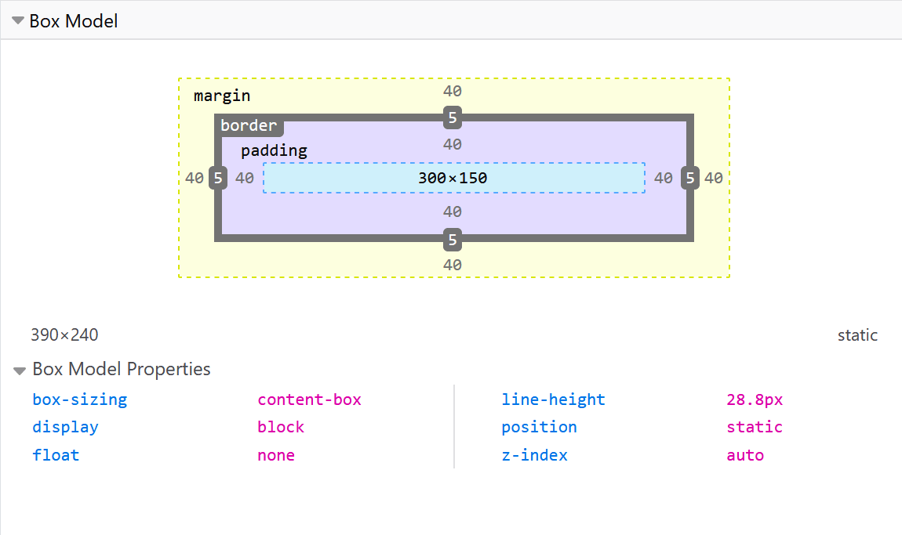

# The Box Model

## Block and inline boxes

In CSS we have several types of boxes that generally fit into the categories of **block boxes** and **inline boxes**.
The type refers to how the box behaves in terms of page flow and in relation to other boxes on the page.
Boxes have an **inner display type** and an **outer display type**.

In general, you can set various values for the display type using the `display` property, which can have
various values.

### Outer Display Type

If a box has an outer display type of `block`, then:

- The box will break onto a new line.
- The `width` and `height` properties are respected.
- Padding, margin and border will cause other elements to be pushed away from the box.
- If `width` is not specified, the box will extend in the inline direction to fill the space available in its
container. In most cases, the box will become as wide as its container (filling 100% of the available space).

If a box has an outer display type of `inline`, then:

- The box will not break onto a new line.
- The `width` and `height` properties will not apply.
- Top and bottom padding, margins, and borders will apply but will not cause other inline boxes to move
away from the box.
- Left and right padding, margins, and borders will apply and will cause other inline boxes to move away
from the box.

Some HTML elements, such as `<a>`, ``, `<em>` and `<strong>` use inline as their outer display type by default

### Inner display type

Boxes also have an inner display type, which dictates how elements inside that box are laid out.

Block and inline layout is the default way things behave on the web. By default and without any other
instruction, the elements inside a box are also laid out in normal flow and behave as block or inline boxes.

You can change the inner display type for example by setting `display: flex`;. The element will still use the
outer display type `block` but this changes the inner display type to `flex`. Any direct children of this box
will become flex items and behave according to the Flexbox specification.

When you move on to learn about CSS Layout in more detail, you will encounter `flex`, and various other inner
values that your boxes can have, for example `grid`.

##### Outer Display Type

***CSS***

    p, 
    ul {
      border: 2px solid rebeccapurple;
      padding: .5em;
    }

    .block,
    li {
      border: 2px solid blue;
      padding: .5em;
    }

    ul {
      display: flex;
      list-style: none;
    }

    .block {
      display: block;
    }      

***HTML***

    
I am a paragraph. A short one.

    <ul>
      <li>Item One</li>
      <li>Item Two</li>
      <li>Item Three</li>
    </ul>
    
I am another paragraph. Some of the words have been wrapped in a span 
    element.

##### Inner Display type

***CSS***

    p, 
    ul {
      border: 2px solid rebeccapurple;
    }

    span,
    li {
      border: 2px solid blue;
    }

    ul {
      display: inline-flex;
      list-style: none;
      padding: 0;
    } 

    .inline {
      display: inline;
    }

***HTML***

    

        I am a paragraph. Some of the
        words have been wrapped in a
        span element.
    
     
    <ul>
      <li>Item One</li>
      <li>Item Two</li>
      <li>Item Three</li>
    </ul>
    
I am a paragraph. A short one.

    
I am another paragraph. Also a short one.

## What is the CSS box model?

The CSS box model as a whole applies to block boxes and defines how the different parts of a box — margin, border,
padding, and content — work together to create a box that you can see on a page. Inline boxes use just some of the
behavior defined in the box model.

To add complexity, there is a standard and an alternate box model. By default, browsers use the standard box model.

### Parts of a box

Making up a block box in CSS we have the:

- **Content box**: The area where your content is displayed; size it using properties like `inline-size` and `block-size` or `width` and `height`.
- **Padding box**: The padding sits around the content as white space; size it using `padding` and related properties.
- Border box: The border box wraps the content and any padding; size it using `border` and related properties.
- Margin box: The margin is the outermost layer, wrapping the content, padding, and border as whitespace between
this box and other elements; size it using `margin` and related properties.

##### The below diagram shows these layers:

### ***The Standard CSS Box Model***
If we assume that a box has the following CSS:

    .box {
      width: 350px;
      height: 150px;
      margin: 10px;
      padding: 25px;
      border: 5px solid black;
    }

The actual space taken up by the box will be 410px wide (350 + 25 + 25 + 5 + 5) and 210px high (150 + 25 + 25 + 5 +
5).

### ***The Alternative CSS Box Model***

In the alternative box model, any width is the width of the visible box on the page. The content area width is that
width minus the width for th padding and border. No need to do math and determin the size.. Thank God..

To turn on the alternative model for an element, set `box-sizing`: `border-box` on it:

    .box {
      box-sizing: border-box;
    }

If we assume the box has the same CSS as above:

    .box {
      width: 350px;
      inline-size: 350px;
      height: 150px;
      block-size: 150px;
      margin: 10px;
      padding: 25px;
      border: 5px solid black;
    }

Now, the actual space taken up by the box will be 350px in the inline direction and 150px in the block direction.

*To use the alternative box model for all of your elements (which is a common choice among developers), set the*
`box-sizing` *property on the* `<html>` *element and set all other elements to inherit that value:*

    html {
      box-sizing: border-box;
    }
    *,
    *::before,
    *::after {
      box-sizing: inherit;
    }

## Dev-Tools to view Box Model

## Margin properties

We can control all margins of an element at once using the `margin` property, or each side individually using the equivalent longhand properties:

`margin-top`
`margin-right`
`margin-bottom`
`margin-left`

## Border properties

You can set the width, style, or color of all four borders at once using the border property.

To set the properties of each side individually, use:

- `border-top`
- `border-right`
- `border-bottom`
- `border-left`

To set the width, style, or color of all sides, use:

- `border-width`
- `border-style`
- `border-color`

To set the width, style, or color of a single side, use one of the more granular longhand properties:

- `border-top-width`
- `border-top-style`
- `border-top-color`
- `border-right-width`
- `border-right-style`
- `border-right-color`
- `border-bottom-width`
- `border-bottom-style`
- `border-bottom-color`
- `border-left-width`
- `border-left-style`
- `border-left-color`

## Padding Properties

The padding sits between the border and the content area and is used to push the content away from the border.
Unlike margins, you cannot have a negative padding. Any background applied to your element will display behind the
padding.

The `padding` property controls the padding on all sides of an element. To control each side individually, use these
longhand properties:

- `padding-top`
- `padding-right`
- `padding-bottom`
- `padding-left`

In the example below, you can change the values for padding on the class `.box` to see that this changes where the
text begins in relation to the box. You can also change the padding on the class `.container` to create space
between the container and the box. You can change the padding on any element to create space between its border and
whatever is inside the element.

___

# Arrays

## Creating arrays

Arrays consist of square brackets and items that are separated by commas.

1. Suppose we want to store a shopping list in an array. Paste the following code into the console:

        const shopping = ["bread", "milk", "cheese", "hummus", "noodles"];
        console.log(shopping);

2. In the above example, each item is a string, but in an array we can store various data types — strings, numbers,
objects, and even other arrays. We can also mix data types in a single array — we do not have to limit ourselves to
storing only numbers in one array, and in another only strings. For example:

        const sequence = [1, 1, 2, 3, 5, 8, 13];
        const random = ["tree", 795, [0, 1, 2]];

### ***Finding the length of an array***

You can find out the length of an array (how many items are in it) in exactly the same way as you find out the length (in characters) of a string — by using the length property. Try the following:

    const shopping = ["bread", "milk", "cheese", "hummus", "noodles"];
    console.log(shopping.length); // 5

### ***Accessing and modifying array items***

Items in an array are numbered, starting from zero. This number is called the item's
index. So the first item has index 0, the second has index 1, and so on. You can access
individual items in the array using bracket notation and supplying the item's index, in
the same way that you accessed the letters in a string.

1. Enter the following into your console:

        const shopping = ["bread", "milk", "cheese", "hummus", "noodles"];
        console.log(shopping[0]);
        // returns "bread"

2. You can also modify an item in an array by giving a single array item a new value. Try
this:

        const shopping = ["bread", "milk", "cheese", "hummus", "noodles"];
        shopping[0] = "tahini";
        console.log(shopping);
        // shopping will now return [ "tahini", "milk", "cheese", "hummus", "noodles" ]

3. Note that an array inside an array is called a multidimensional array. You can access
an item inside an array that is itself inside another array by chaining two sets of
square brackets together. For example, to access one of the items inside the array that
is the third item inside the `random` array (see previous section), we could do something
like this:

        const random = ["tree", 795, [0, 1, 2]];
        random[2][2];

### ***Finding the index of items in an array***

If you don't know the index of an item, you can use the `indexOf()` method. The `indexOf()`
method takes an item as an argument and will either return the item's index or `-1` if the
item is not in the array:

    const birds = ["Parrot", "Falcon", "Owl"];
    console.log(birds.indexOf("Owl")); //  2
    console.log(birds.indexOf("Rabbit")); // -1

### ***Adding items***

To add one or more items to the end of an array we can use `push()`. Note that you need to
include one or more items that you want to add to the end of your array.

    const cities = ["Manchester", "Liverpool"];
    cities.push("Cardiff");
    console.log(cities); // [ "Manchester", "Liverpool", "Cardiff" ]
    cities.push("Bradford", "Brighton");
    console.log(cities); // [ "Manchester", "Liverpool", "Cardiff", "Bradford", "Brighton" ]

The new length of the array is returned when the method call completes. If you wanted to
store the new array length in a variable, you could do something like this:

      const cities = ["Manchester", "Liverpool"];
      const newLength = cities.push("Bristol");
      console.log(cities); // [ "Manchester", "Liverpool", "Bristol" ]
      console.log(newLength); // 3

To add an item to the start of the array, use `unshift()`:

    const cities = ["Manchester", "Liverpool"];
    cities.unshift("Edinburgh");
    console.log(cities); // [ "Edinburgh", "Manchester", "Liverpool" ]

### ***Removing items***

To remove the last item from the array, use `pop()`.

    const cities = ["Manchester", "Liverpool"];
    cities.pop();
    console.log(cities); // [ "Manchester" ]

The `pop()` method returns the item that was removed. To save that item in a new variable,
you could do this:

    const cities = ["Manchester", "Liverpool"];
    const removedCity = cities.pop();
    console.log(removedCity); // "Liverpool"

To remove the first item from an array, use `shift()`:

    const cities = ["Manchester", "Liverpool"];
    cities.shift();
    console.log(cities); // [ "Liverpool" ]

If you know the index of an item, you can remove it from the array using `splice()`:

    const cities = ["Manchester", "Liverpool", "Edinburgh", "Carlisle"];
    const index = cities.indexOf("Liverpool");
    if (index !== -1) {
      cities.splice(index, 1);
    }
    console.log(cities); // [ "Manchester", "Edinburgh", "Carlisle" ]

In this call to `splice()`, the first argument says where to start removing items, and the
second argument says how many items should be removed. So you can remove more than one item:

    const cities = ["Manchester", "Liverpool", "Edinburgh", "Carlisle"];
    const index = cities.indexOf("Liverpool");
    if (index !== -1) {
      cities.splice(index, 2);
    }
    console.log(cities); // [ "Manchester", "Carlisle" ]

### ***Accessing every item***

Very often you will want to access every item in the array. You can do this using the
`for...of` statement:

    const birds = ["Parrot", "Falcon", "Owl"];

    for (const bird of birds) {
      console.log(bird);
    }

Sometimes you will want to do the same thing to each item in an array, leaving you with an
array containing the changed items. You can do this using `map()`. The code below takes an
array of numbers and doubles each number:

    function double(number) {
      return number * 2;
    }
    const numbers = [5, 2, 7, 6];
    const doubled = numbers.map(double);
    console.log(doubled); // [ 10, 4, 14, 12 ]

We give a function to the `map()`, and `map()` calls the function once for each item in the array, passing in the item. It then adds the return value from each function call to a new array, and finally returns the new array.

Sometimes you'll want to create a new array containing only the items in the original array that match some test. You can do that using `filter()`. The code below takes an array of strings and returns an array containing just the strings that are greater than 8 characters long:

    function isLong(city) {
      return city.length > 8;
    }
    const cities = ["London", "Liverpool", "Totnes", "Edinburgh"];
    const longer = cities.filter(isLong);
    console.log(longer); // [ "Liverpool", "Edinburgh" ]

Like `map()`, we give a function to the `filter()` method, and `filter()` calls this
function for every item in the array, passing in the item. If the function returns `true`,
then the item is added to a new array. Finally it returns the new array.

### ***Converting between strings and arrays***

Often you'll be presented with some raw data contained in a big long string, and you might
want to separate the useful items out into a more useful form and then do things to them,
like display them in a data table. To do this, we can use the split() method. In its
simplest form, this takes a single parameter, the character you want to separate the string
at, and returns the substrings between the separator as items in an array.

***Note***: *Okay, this is technically a string method, not an array method, but we've put
it in with arrays as it goes well here.*

1. Let's play with this, to see how it works. First, create a string in your console:

        const data = "Manchester,London,Liverpool,Birmingham,Leeds,Carlisle";

2. Now let's split it at each comma:

        const cities = data.split(",");
        cities;

3. Finally, try finding the length of your new array, and retrieving some items from it:

        cities.length;
        cities[0]; // the first item in the array
        cities[1]; // the second item in the array
        cities[cities.length - 1]; // the last item in the array

4. You can also go the opposite way using the `join()` method. Try the following:

        const commaSeparated = cities.join(",");
        commaSeparated;

5. Another way of converting an array to a string is to use the `toString()` method. `toString()` is arguably
simpler than `join()` as it doesn't take a parameter, but more limiting. With `join()` you can specify different
separators, whereas `toString()` always uses a comma. (Try running Step 4 with a different character than a comma.)

        const dogNames = ["Rocket", "Flash", "Bella", "Slugger"];
        dogNames.toString(); // Rocket,Flash,Bella,Slugger

___

# Expressions and Operators

## Assignment Operators

|Name|Shorthand operator|Meaning|
|----|----|----|
|Assignment|`x = f()`|`x = f()`|
|Addition assignment|`x += f()`|`x = x + f()`|
|Subtraction assignment|`x -= f()`|`x = x - f()`|
|Multiplication assignment|`x *= f()`|`x = x * f()`|
|Division assignment|`x /= f()`|`x = x / f()`|
|Remainder assignment|`x %= f()`|`x = x % f()`|
|Exponentiation assignment|`x **= f()`|`x = x ** f()`|
|Left shift assignment|`x <<= f()`|`x = x << f()`|
|Right shift assignment|`x >>= f()`|`x = x >> f()`|
|Unsigned right shift assignment|`x >>>= f()`|`x = x >>> f()`|
|Bitwise AND assignment|`x &= f()`|`x = x & f()`|
|Bitwise XOR assignment|`x ^= f()`|`x = x ^ f()`|
|Bitwise OR assignment|`x \|= f()`|`x = x \| f()`|
|Logical AND assignment|`x &&= f()`|`x && (x = f())`|
|Logical OR assignment| `x \|\|= f()`| `x \|\| (x = f())`|
|Nullish coalescing assignment|`x ??= f()`|`x ?? (x = f())`|

## Comparison Operators

|Operator|Description|Examples returning true|
|-----|-------|----|
|Equal (==)|Returns true if the operands are equal.|3 == var1, "3" == var1, 3 == '3'|
|Not equal (!=)|Returns true if the operands are not equal.|var1 != 4, var2 != "3"|
|Strict equal (===)|Returns true if the operands are equal and of the same type. See also Object.is and sameness in JS.|3 === var1|
|Strict not equal (!==)|Returns true if the operands are of the same type but not equal, or are of different type.|var1 !== "3", 3 !== '3'|
|Greater than (>)|Returns true if the left operand is greater than the right operand.|var2 > var1, "12" > 2|
|Greater than or equal (>=)|Returns true if the left operand is greater than or equal to the right operand.|var2 >= var1, var1 >= 3|
|Less than (<)|Returns true if the left operand is less than the right operand.|var1 < var2, "2" < 12|
|Less than or equal (<=)|Returns true if the left operand is less than or equal to the right operand.|var1 <= var2, var2 <= 5|

## Arithmetic Operators

|Operator|Description|Example|
|-----------|----|----------|
|Remainder (%)|Binary operator. Returns the integer remainder of dividing the two operands.|12 % 5 returns 2.|
|Increment (++)|Unary operator. Adds one to its operand. If used as a prefix operator (++x), returns the value of its operand after adding one; if used as a postfix operator (x++), returns the value of its operand before adding one.|If x is 3, then ++x sets x to 4 and returns 4, whereas x++ returns 3 and, only then, sets x to 4.|
|Decrement (--)|Unary operator. Subtracts one from its operand. The return value is analogous to that for the increment operator.|If x is 3, then --x sets x to 2 and returns 2, whereas x-- returns 3 and, only then, sets x to 2.|
|Unary negation (-)|Unary operator. Returns the negation of its operand.|If x is 3, then -x returns -3.|
|Unary plus (+)|Unary operator. Attempts to convert the operand to a number, if it is not already.|+"3" returns 3., +true returns 1.|
|Exponentiation operator (**)|Calculates the base to the exponent power, that is, base^exponent|2 ** 3 returns 8., 10 ** -1 returns 0.1.|

___

# Looping Code

[Link to the Page on MDN](https://developer.mozilla.org/en-US/docs/Learn/JavaScript/Building_blocks/Looping_code#why_are_loops_useful)

___
