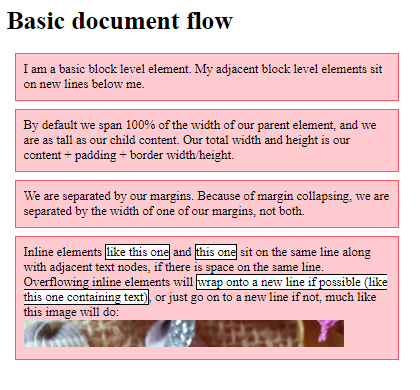
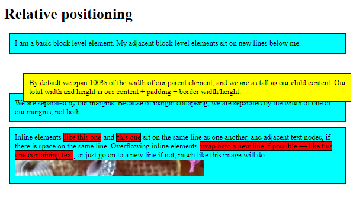
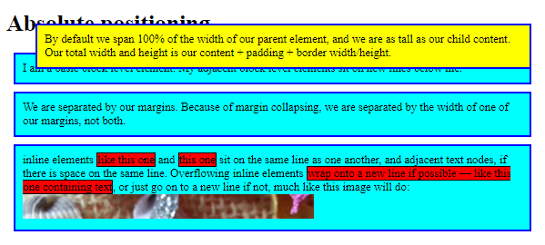
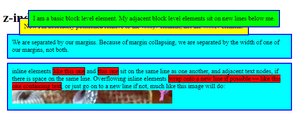
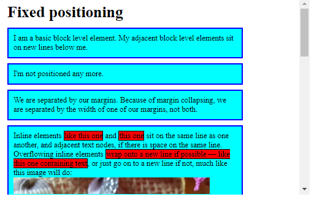
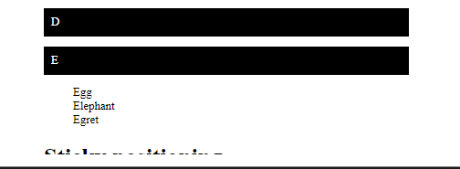

# Normal Flow

## How are elements laid out by default?

The process begins as the boxes of individual elements are laid out in such a way that any padding, border, or margin they happen to have is added to their content. This is what we call the box model.

By default, a `block-level element`'s content fills the available inline space of the parent element containing it, growing along the block dimension to accommodate its content. The size of `inline-level elements` is just the size of their content. You can set `width` or `height` on some elements that have a default `display` property value of `inline`, like ``, but `display` value will still remain `inline`.

If you want to control the `display` property of an inline-level element in this manner, use CSS to set it to behave like a block-level element (e.g., with `display: block`; or `display: inline-block`;, which mixes characteristics from both).

That explains how elements are structured individually, but how about the way they're structured when they interact with one another? The normal layout flow (mentioned in the layout introduction article) is the system by which elements are placed inside the browser's viewport. By default, block-level elements are laid out in the block flow direction, which is based on the parent's writing mode (initial: horizontal-tb). Each element will appear on a new line below the last one, with each one separated by whatever margin that's been specified. In English, for example, (or any other horizontal, top to bottom writing mode) block-level elements are laid out vertically.

Inline elements behave differently. They don't appear on new lines; instead, they all sit on the same line along with any adjacent (or wrapped) text content as long as there is space for them to do so inside the width of the parent block level element. If there isn't space, then the overflowing content will move down to a new line.

If two vertically adjacent elements both have a margin set on them and their margins touch, the larger of the two margins remains and the smaller one disappears. This is known as margin collapsing. Collapsing margins is only relevant in the vertical direction.

Let's look at a simple example that explains all of this:

***HTML***

    <h1>Basic document flow</h1>

    

      I am a basic block level element. My adjacent block level elements sit on new
      lines below me.
    

    

      By default we span 100% of the width of our parent element, and we are as tall
      as our child content. Our total width and height is our content + padding +
      border width/height.
    

    

      We are separated by our margins. Because of margin collapsing, we are
      separated by the width of one of our margins, not both.
    

    

      Inline elements like this one and this one sit on
      the same line along with adjacent text nodes, if there is space on the same
      line. Overflowing inline elements will
      wrap onto a new line if possible (like this one containing text),
      or just go on to a new line if not, much like this image will do:
      
    

***CSS***

    body {
      width: 500px;
      margin: 0 auto;
    }

    p {
      background: rgba(255, 84, 104, 0.3);
      border: 2px solid rgb(255, 84, 104);
      padding: 10px;
      margin: 10px;
    }

    span {
      background: white;
      border: 1px solid black;
    }

___

# Positioning

## Static Positioning

Static positioning is the default that every element gets. It just means "put the element into its normal position in the document flow — nothing special to see here."

To see this (and get your example set up for future sections) first add a `class` of `positioned` to the second `
` in the HTML:

    
…

Now add the following rule to the bottom of your CSS:

    .positioned {
      position: static;
      background: yellow;
    }

If you save and refresh, you'll see no difference at all, except for the updated background color of the 2nd paragraph. This is fine — as we said before, static positioning is the default behavior!

***Note***: *You can see the example at this point live at* `1_static-positioning.html`

## Relative positioning

Relative positioning is the first position type we'll take a look at. This is very similar to static positioning, except that once the positioned element has taken its place in the normal flow, you can then modify its final position, including making it overlap other elements on the page. Go ahead and update the `position` declaration in your code:

    position: relative;

If you save and refresh at this stage, you won't see a change in the result at all. So how do you modify the element's position? You need to use the `top`, `bottom`, `left`, and `right` properties, which we'll explain in the next section.

### Introducing top, bottom, left, and right

`top`, `bottom`, `left`, and `right` are used alongside `position` to specify exactly where to move the positioned element to. To try this out, add the following declarations to the `.positioned` rule in your CSS:

    top: 30px;
    left: 30px;

***Note***: *The values of these properties can take any units you'd reasonably expect: pixels, mm, rems, %, etc.*

If you now save and refresh, you'll get a result something like this:

## Absolute positioning

Absolute positioning brings very different results.

### Setting position: absolute
L
et's try changing the position declaration in your code as follows:

    position: absolute;

If you now save and refresh, you should see something like so:

First of all, note that the gap where the positioned element should be in the document flow is no longer there — the first and third elements have closed together like it no longer exists! Well, in a way, this is true. An absolutely positioned element no longer exists in the normal document flow. Instead, it sits on its own layer separate from everything else. This is very useful: it means that we can create isolated UI features that don't interfere with the layout of other elements on the page. For example, popup information boxes, control menus, rollover panels, UI features that can be dragged and dropped anywhere on the page, and so on.

Second, notice that the position of the element has changed. This is because `top`, `bottom`, `left`, and `right` behave in a different way with absolute positioning. Rather than positioning the element based on its relative position within the normal document flow, they specify the distance the element should be from each of the containing element's sides. So in this case, we are saying that the absolutely positioned element should sit 30px from the top of the "containing element" and 30px from the left. (In this case, the "containing element" is the **initial containing block**. See the section below for more information)

***Note***: *You can use* `top`*,* `bottom`*,* `left`*, and* `right` *to resize elements if you need to. Try setting* `top: 0; bottom: 0; left: 0; right: 0;` *and* `margin: 0;` *on your positioned elements and see what happens! Put it back again afterwards…*

***Note***: *Yes, margins still affect positioned elements. Margin collapsing doesn't, however.*

***Note***: *You can see the example at this point live at* `3_absolute-positioning.html`

### Introducing Z-index

All this absolute positioning is good fun, but there's another feature we haven't considered yet. When elements start to overlap, what determines which elements appear over others and which elements appear under others? In the example we've seen so far, we only have one positioned element in the positioning context, and it appears on the top since positioned elements win over non-positioned elements. What about when we have more than one?

Try adding the following to your CSS to make the first paragraph absolutely positioned too:

    p:nth-of-type(1) {
      position: absolute;
      background: lime;
      top: 10px;
      right: 30px;
    }

At this point you'll see the first paragraph colored lime, moved out of the document flow, and positioned a bit above from where it originally was. It's also stacked below the original `.positioned` paragraph where the two overlap. This is because the `.positioned` paragraph is the second paragraph in the source order, and positioned elements later in the source order win over positioned elements earlier in the source order.

Can you change the stacking order? Yes, you can, by using the `z-index` property. "z-index" is a reference to the z-axis. You may recall from previous points in the course where we discussed web pages using horizontal (x-axis) and vertical (y-axis) coordinates to work out positioning for things like background images and drop shadow offsets. For languages that run left to right, (0,0) is at the top left of the page (or element), and the x- and y-axes run across to the right and down the page.

Web pages also have a z-axis: an imaginary line that runs from the surface of your screen towards your face (or whatever else you like to have in front of the screen). `z-index` values affect where positioned elements sit on that axis; positive values move them higher up the stack, negative values move them lower down the stack. By default, positioned elements all have a `z-index` of `auto`, which is effectively 0.

To change the stacking order, try adding the following declaration to your `p:nth-of-type(1)` rule:

    z-index: 1;

You should now see the lime paragraph on top:

## Fixed positioning

Let's now look at fixed positioning. This works in exactly the same way as absolute positioning, with one key difference: whereas absolute positioning fixes an element in place relative to its nearest positioned ancestor (the initial containing block if there isn't one), fixed positioning usually fixes an element in place relative to the visible portion of the viewport. (An exception to this occurs if one of the element's ancestors is a fixed containing block because its transform property has a value other than none.) This means that you can create useful UI items that are fixed in place, like persistent navigation menus that are always visible no matter how much the page scrolls.

Let's put together a simple example to show what we mean. First of all, delete the existing `p:nth-of-type(1)` and `.positioned` rules from your CSS.

Now update the body rule to remove the `position: relative`; declaration and add a fixed height, like so:

    body {
      width: 500px;
      height: 1400px;
      margin: 0 auto;
    }

Now we're going to give the `h1` element `position: fixed`; and have it sit at the top of the viewport. Add the following rule to your CSS:

    h1 {
      position: fixed;
      top: 0;
      width: 500px;
      margin-top: 0;
      background: white;
      padding: 10px;
    }

The `top: 0`; is required to make it stick to the top of the screen. We give the heading the same width as the content column and then a white background and some padding and margin so the content won't be visible underneath it.

If you save and refresh, you'll see a fun little effect of the heading staying fixed — the content appears to scroll up and disappear underneath it. But notice how some of the content is initially clipped under the heading. This is because the positioned heading no longer appears in the document flow, so the rest of the content moves up to the top. We could improve this by moving the paragraphs all down a bit. We can do this by setting some top margin on the first paragraph. Add this now:

    p:nth-of-type(1) {
      margin-top: 60px;
    }

You should now see the finished example:

## Sticky positioning

There is another position value available called `position: sticky`, which is somewhat newer than the others. This is basically a hybrid between relative and fixed position. It allows a positioned element to act like it's relatively positioned until it's scrolled to a certain threshold (e.g., 10px from the top of the viewport), after which it becomes fixed.

### Basic example

Sticky positioning can be used, for example, to cause a navigation bar to scroll with the page until a certain point and then stick to the top of the page.

    .positioned {
      position: sticky;
      top: 30px;
      left: 30px;
    }

https://developer.mozilla.org/en-US/docs/Learn/CSS/CSS_layout/Positioning#basic_example 

- link to the sticky position example.

### Scrolling index

An interesting and common use of position: sticky is to create a scrolling index page where different headings stick to the top of the page as they reach it. The markup for such an example might look like so:

    <h1>Sticky positioning</h1>
    
    <dl>
      <dt>A</dt>
      <dd>Apple</dd>
      <dd>Ant</dd>
      <dd>Altimeter</dd>
      <dd>Airplane</dd>
      <dt>B</dt>
      <dd>Bird</dd>
      <dd>Buzzard</dd>
      <dd>Bee</dd>
      <dd>Banana</dd>
      <dd>Beanstalk</dd>
      <dt>C</dt>
      <dd>Calculator</dd>
      <dd>Cane</dd>
      <dd>Camera</dd>
      <dd>Camel</dd>
      <dt>D</dt>
      <dd>Duck</dd>
      <dd>Dime</dd>
      <dd>Dipstick</dd>
      <dd>Drone</dd>
      <dt>E</dt>
      <dd>Egg</dd>
      <dd>Elephant</dd>
      <dd>Egret</dd>
    </dl>

The CSS might look as follows. In normal flow the `<dt>` elements will scroll with the content. When we add position: sticky to the `<dt>` element, along with a `top` value of 0, supporting browsers will stick the headings to the top of the viewport as they reach that position. Each subsequent header will then replace the previous one as it scrolls up to that position.

    dt {
      background-color: black;
      color: white;
      padding: 10px;
      position: sticky;
      top: 0;
      left: 0;
      margin: 1em 0;
    }

___
