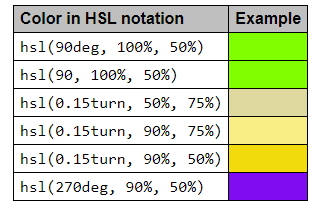
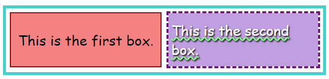
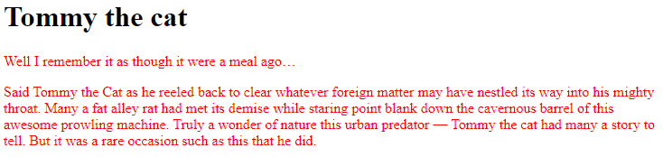
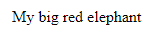
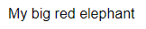
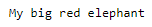
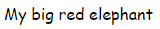
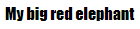

# HTML Media

## Using Images in HTML

`` tag to insert and image and annotate it with captions using the `<figure>` tag.

### *How do we put an image on a webpage?*

In order to put a simple image on a web page, we use the `` element. This is a void
element (meaning, it cannot have any child content and cannot have an end tag) that
requires two attributes to be useful: `src` and `alt`. The `src` attribute contains a URL
pointing to the image you want to embed in the page. As with the `href` attribute for `<a>`
elements, the `src` attribute can be a relative URL or an absolute URL. Without a `src`
attribute, an `img` element has no image to load.

Examples:

    
Or if the image is in a `images` subdirectory:

    

### *Alternative text*

The next attribute we'll look at is alt. Its value is supposed to be a textual description
of the image, for use in situations where the image cannot be seen/displayed or takes a
long time to render because of a slow internet connection. For example, our above code
could be modified like so:

    

What exactly should you write inside your alt attribute? It depends on why the image is there in the first place. In other words, what you lose if your image doesn't show up:

- **Decoration**. You should use CSS background images for decorative images, but if you must use HTML, add a
blank `alt=""`. If the image isn't part of the content, a screen reader shouldn't waste time reading it.
- **Content**. If your image provides significant information, provide the same information in a brief `alt`
text – or even better, in the main text which everybody can see. Don't write redundant `alt` text. How annoying
would it be for a sighted user if all paragraphs were written twice in the main content? If the image is
described adequately by the main text body, you can just use `alt=""`.
- **Link**. If you put an image inside `<a>` tags, to turn an image into a link, you still must provide
accessible link text. In such cases you may, either, write it inside the same `<a>` element, or inside the
image's `alt` attribute – whichever works best in your case.
- **Text**. You should not put your text into images. If your main heading needs a drop shadow, for example,
use CSS for that rather than putting the text into an image. However, If you really can't avoid doing this, you
should supply the text inside the `alt` attribute.

### *Width and height*
You can use the `width` and `height` attributes to specify the width and height of your image. You can find your image's width and height in a number of ways. For example on the Mac you can use `Cmd + I` to get the info display up for the image file. Returning to our example, we could do this:

    

### *Image Titles*

As with links, you can also add `title` attributes to images, to provide further supporting information if needed. In our example, we could do this:

    

### *Annotating images with figures and figure captions*

Speaking of captions, there are a number of ways that you could add a caption to go with your image. For
example, there would be nothing to stop you from doing this:

    

      

      
A T-Rex on display in the Manchester University Museum.

    

This is OK. It contains the content you need, and is nicely stylable using CSS. But there is a problem here:
there is nothing that semantically links the image to its caption, which can cause problems for screen readers.
For example, when you have 50 images and captions, which caption goes with which image?

A better solution, is to use the HTML `<figure>` and `<figcaption>` elements. These are created for exactly
this purpose: to provide a semantic container for figures, and to clearly link the figure to the caption. Our
above example could be rewritten like this:

    <figure>
      

      <figcaption>
        A T-Rex on display in the Manchester University Museum.
      </figcaption>
    </figure>

The `<figcaption>` element tells browsers, and assistive technology that the caption describes the other
content of the `<figure>` element.

### *CSS backgroung images*

You can also use CSS to embed images into webpages (and JavaScript, but that's another story entirely). The CSS
`background-image` property, and the other `background-*` properties, are used to control background image
placement. For example, to place a background image on every paragraph on a page, you could do this:

    p {
      background-image: url("images/dinosaur.jpg");
    }

The resulting embedded image is arguably easier to position and control than HTML images. So why bother with
HTML images? As hinted to above, CSS background images are for decoration only. If you just want to add
something pretty to your page to enhance the visuals, this is fine. Though, such images have no semantic
meaning at all. They can't have any text equivalents, are invisible to screen readers, and so on. This is where
HTML images shine!

Summing up: if an image has meaning, in terms of your content, you should use an HTML image. If an image is
purely decoration, you should use CSS background images.

___
## Common Image Types

The image file formats that are most commonly used on the web are listed below.

|Abbr|Format|MIME type|File Ext.|Summary|
|----|------|---------|---------|-------|
|APNG|Animated Portable Network Graphics|`image/apng`|`.apng`|Good choice for lossless animation sequences (GIF is less performant). AVIF and WebP have better performance but less broad browser support. **Supported**: Chrome, Edge, Firefox, Opera, Safari.|
|AVIF|AV1 Image File Format|`image/avif`|`.avif`|Good choice for both images and animated images due to high performance and royalty free image format. It offers much better compression than PNG or JPEG with support for higher color depths, animated frames, transparency, etc. Note that when using AVIF, you should include fallbacks to formats with better browser support (i.e. using the `<picture>` element). **Supported**: Chrome, Firefox (still images only: animated images not implemented), Opera, Safari.|
|GIF|Graphics Interchange Format|`image/gif`|`.gif`|Good choice for simple images and animations. Prefer PNG for lossless and indexed still images, and consider WebP, AVIF or APNG for animation sequences. **Supported**: Chrome, Edge, Firefox, IE, Opera, Safari.|
|JPEG|Joint Photographic Expert Group image|`image/jpeg`|`.jpg, .jpeg, .jfif, .pjpeg, .pjp`|Good choice for lossy compression of still images (currently the most popular). Prefer PNG when more precise reproduction of the image is required, or WebP/AVIF if both better reproduction and higher compression are required.**Support**: Chrome, Edge, Firefox, IE, Opera, Safari.|
|PNG|Portable Network Graphics|`image/png`|`.png`|PNG is preferred over JPEG for more precise reproduction of source images, or when transparency is needed. WebP/AVIF provide even better compression and reproduction, but browser support is more limited. **Support**: Chrome, Edge, Firefox, IE, Opera, Safari.|
|SVG|Scalable Vector Graphics|`image/svg+sml`|`.svg`|	Vector image format; ideal for user interface elements, icons, diagrams, etc., that must be drawn accurately at different sizes. **Support**: Chrome, Edge, Firefox, IE, Opera, Safari.|
|WebP|Web Picture format|`image/webp`|`.webp`|Excellent choice for both images and animated images. WebP offers much better compression than PNG or JPEG with support for higher color depths, animated frames, transparency etc. AVIF offers slightly better compression, but is not quite as well-supported in browsers and does not support progressive rendering. **Support**: Chrome, Edge, Firefox, Opera, Safari|

### [Image file type details](https://developer.mozilla.org/en-US/docs/Web/Media/Formats/Image_types#image_file_type_details)

### [Choosing an image format](https://developer.mozilla.org/en-US/docs/Web/Media/Formats/Image_types#choosing_an_image_format)

### ***Providing image fallbacks***

While the standard HTML `` element doesn't support compatibility fallbacks for images, the `<picture>` element does. `<picture>` is used as a wrapper for a number of `<source>` elements, each specifying a version of the image in a different format or under different media conditions, as well as an `` element which defines where to display the image and the fallback to the default or "most compatible" version.

For example, if you're displaying a diagram best displayed with SVG, but wish to offer a fallback to a PNG or GIF of the diagram, you would do something like this:

    <picture>
      <source srcset="diagram.svg" type="image/svg+xml" />
      <source srcset="diagram.png" type="image/png" />
      
    </picture>

You can specify as many `<source>`s as you wish, though typically 2 or 3 is all you need.

___

# Learn CSS

## Using Color in CSS

### **Things that can have color**
At the element level, everything in HTML can have color applied to it. Instead, let's look at things in terms of the kinds of things that are drawn in the elements, such as text and borders and so forth. For each, we'll see a list of the CSS properties that apply color to them.

At a fundamental level, the `color` property defines the foreground color of an HTML element's content and the `background-color` property defines the element's background color. These can be used on just about any element.

### *Text*

Whenever an element is rendered, these properties are used to determine the color of the text, its background, and any decorations on the text.

#### `color`

The color to use when drawing the text and any text decorations (such as the addition of under- or overlines, strike-through lines, and so forth.

#### `background-color`

The text's background color.

#### `text-shadow`

Configures a shadow effect to apply to text. Among the options for the shadow is the shadow's base color (which is then blurred and blended with the background based on the other parameters). See Text drop shadows to learn more.

#### `text-decoration-color`

By default, text decorations (such as underlines, strikethroughs, etc.) use the `color` property as their colors. However, you can override that behavior and use a different color for them with the `text-decoration-color` property.

#### `text-emphasis-color`

The color to use when drawing emphasis symbols adjacent to each character in the text. This is used primarily when drawing text for East Asian languages.

#### `caret-color`

The color to use when drawing the caret (sometimes referred to as the text input cursor) within the element. This is only useful in elements that are editable, such as `<input>` and `<textarea>` or elements whose HTML `contenteditable` attribute is set.

### Boxes

Every element is a box with some sort of content, and has a background and a border in addition to whatever contents the box may have.

#### Borders

See the section Borders for a list of the CSS properties you can use to set the colors of a box's borders.

#### `background-color`

The background color to use in areas of the element that have no foreground content.

#### `column-rule-color`

The color to use when drawing the line separating columns of text.

#### `outline-color`

The color to use when drawing an outline around the outside of the element. This outline is different from the border in that it doesn't get space set aside for it in the document (so it may overlap other content). It's generally used as a focus indicator, to show which element will receive input events.

### Borders

Any element can have a border drawn around it. A basic element border is a line drawn around the edges of the element's content. See The box model to learn about the relationship between elements and their borders, and the article Styling borders using CSS to learn more about applying styles to borders.

You can use the `border` shorthand property, which lets you configure everything about the border in one shot (including non-color features of borders, such as its width, style solid, dashed, etc.), and so forth.

#### `border-color`

Specifies a single color to use for every side of the element's border.

#### `border-left-color`, `border-right-color`, `border-top-color`, and `border-bottom-color`

Lets you set the color of the corresponding side of the element's border.

#### `border-block-start-color` and `border-block-end-color`

With these, you can set the color used to draw the borders which are closest to the start and end of the block the border surrounds. In a left-to-right writing mode (such as the way English is written), the block start border is the top edge and the block end is the bottom. This differs from the inline start and end, which are the left and right edges (corresponding to where each line of text in the box begins and ends).

#### `border-inline-start-color` and `border-inline-end-color`

These let you color the edges of the border closest to the beginning and the end of the start of lines of text within the box. Which side this is will vary depending on the `writing-mode`, `direction`, and `text-orientation` properties, which are typically (but not always) used to adjust text directionality based on the language being displayed. For example, if the box's text is being rendered right-to-left, then the `border-inline-start-color` is applied to the right side of the border.

### Other ways to use color

CSS isn't the only web technology that supports color. There are graphics technologies that are available on the web which also support color.

#### The HTML Canvas API

Lets you draw 2D bitmapped graphics in a `<canvas>` element. See our Canvas tutorial to learn more.

#### SVG (Scalable Vector Graphics)

Lets you draw images using commands that draw specific shapes, patterns, and lines to produce an image. SVG commands are formatted as XML, and can be embedded directly into a web page or can be placed in the page using the `` element, just like any other type of image.

#### WebGL

The Web Graphics Library is an OpenGL ES-based API for drawing high-performance 2D and 3D graphics on the Web. See our WebGL tutorial to find out more.

## Keywords

A set of standard color names have been defined, letting you use these keywords instead of numeric representations of colors if you choose to do so and there's a keyword representing the exact color you want to use. Color keywords include the standard primary and secondary colors (such as `red`, `blue`, or `orange`), shades of gray (from `black` to `white`, including colors like `darkgray` and `lightgrey`), and a variety of other blended colors including `lightseagreen`, `cornflowerblue`, and `rebeccapurple`.

See [Named colors](https://developer.mozilla.org/en-US/docs/Web/CSS/named-color) for more information on color keywords.

## RGB Values

There are three ways to represent an RGB Color in CSS

### Hexadecimal String Notation

Hexadecimal string notation represents a color using hexadecimal digits to represent each of the color components (red, green, and blue). It may also include a fourth component: the alpha channel (or opacity). Each color component can be represented as a number between 0 and 255 (0x00 and 0xFF) or, optionally, as a number between 0 and 15 (0x0 and 0xF). All components must be specified using the same number of digits. If you use the single-digit notation, the final color is computed by using each component's digit twice; that is, `"#D"` becomes `"#DD"` when drawing.

A color in hexadecimal string notation always begins with the character `"#"`. After that come the hexadecimal digits of the color code. The string is case-insensitive.

#### `"#rrggbb"`

Specifies a fully-opaque color whose red component is the hexadecimal number `0xrr`, green component is `0xgg`, and blue component is `0xbb`.

#### `"#rrggbbaa"`

Specifies a color whose red component is the hexadecimal number `0xrr`, green component is `0xgg`, and blue component is `0xbb`. The alpha channel is specified by `0xaa`; the lower this value is, the more translucent the color becomes.

#### `"#rgb"`

Specifies a color whose red component is the hexadecimal number `0xrr`, green component is `0xgg`, and blue component is `0xbb`.

#### `"#rgba"`

Specifies a color whose red component is the hexadecimal number `0xrr`, green component is `0xgg`, and blue component is `0xbb`. The alpha channel is specified by `0xaa`; the lower this value is, the more translucent the color becomes.

As an example, you can represent the opaque color bright blue as `"#0000ff"` or `"#00f"`. To make it 25% opaque, you can use `"#0000ff44"` or `"#00f4"`.

### RGB functional notation

RGB (Red/Green/Blue) functional notation, like hexadecimal string notation, represents colors using their red, green, and blue components (as well as, optionally, an alpha channel component for opacity). However, instead of using a string, the color is defined using the CSS function `rgb()`. This function accepts as its input parameters the values of the red, green, and blue components and an optional fourth parameter, the value for the alpha channel.

Legal values for each of these parameters are:

`red`, `green`, and `blue`

- Each must be an `<integer>` value between 0 and 255 (inclusive), or a `<percentage>` from 0% to 100%.

`alpha`

- The alpha channel is a number between 0.0 (fully transparent) and 1.0 (fully opaque). You can also specify a percentage where 0% is the same as 0.0 and 100% is the same as 1.0.

For example, a bright red that's 50% opaque can be represented as `rgb(255, 0, 0, 0.5)` or `rgb(100%, 0, 0, 50%)`.

### HSL functional notation

Designers and artists often prefer to work using the HSL (Hue/Saturation/Luminosity) color method. On the web, HSL colors are represented using HSL functional notation. The `hsl()` CSS function is very similar to the `rgb()` function in usage otherwise.

The diagram below shows an HSL color cylinder. Hue defines the actual color based on the position along a circular color wheel representing the colors of the visible spectrum. Saturation is a percentage of how much of the way between being a shade of gray and having the maximum possible amount of the given hue. As the value of luminance (or lightness) increases, the color transitions from the darkest possible to the brightest possible (from black to white). Image courtesy of user SharkD on Wikipedia, distributed under the CC BY-SA 3.0 license.

The value of the hue (H) component of an HSL color is an angle from red around through yellow, green, cyan, blue, and magenta (ending up back at red again at 360°) that identifies what the base color is. The value can be specified in any `<angle>` unit supported by CSS, including degrees (`deg`), radians (`rad`), gradians (`grad`), or turns (`turn`). But this doesn't control how vivid or dull, or how bright or dark the color is.

The saturation (S) component of the color specifies what percentage of the final color is comprised of the specified hue. The rest is defined by the grey level provided by the luminance (L) component.

Think of it like creating the perfect paint color:

1. You start with base paint that's the maximum intensity possible for a given color, such as the most intense blue that can be represented by the user's screen. This is the hue (H) component: a value representing the angle around the color wheel for the vivid hue we want to use as our base.
2. Then select a greyscale paint that corresponds how bright you want the color to be; this is the luminance. Do you want it to be very bright and nearly white, or very dark and closer to black, or somewhere in between? This is specified using a percentage, where 0% is perfectly black and 100% is perfectly white (regardless of the saturation or hue). In between values are a literal grey area.
3. Now that you have a grey paint and a perfectly vivid color, you need to mix them together. The saturation (S) component of the color indicates what percentage of the final color should be comprised of that perfectly vivid color. The rest of the final color is made up of the grey paint that represents the saturation.

You can also optionally include an alpha channel, to make the color less than 100% opaque.

Here are some sample colors in HSL notation:

    <table>
      <thead>
        <tr>
          <th scope="col">Color in HSL notation</th>
          <th scope="col">Example</th>
        </tr>
      </thead>
      <tbody>
        <tr>
          <td><code>hsl(90deg, 100%, 50%)</code></td>
          <td style="background-color: hsl(90deg, 100%, 50%);">&nbsp;</td>
        </tr>
        <tr>
          <td><code>hsl(90, 100%, 50%)</code></td>
          <td style="background-color: hsl(90, 100%, 50%);">&nbsp;</td>
        </tr>
        <tr>
          <td><code>hsl(0.15turn, 50%, 75%)</code></td>
          <td style="background-color: hsl(0.15turn, 50%, 75%);">&nbsp;</td>
        </tr>
        <tr>
          <td><code>hsl(0.15turn, 90%, 75%)</code></td>
          <td style="background-color: hsl(0.15turn, 90%, 75%);">&nbsp;</td>
        </tr>
        <tr>
          <td><code>hsl(0.15turn, 90%, 50%)</code></td>
          <td style="background-color: hsl(0.15turn, 90%, 50%);">&nbsp;</td>
        </tr>
        <tr>
          <td><code>hsl(270deg, 90%, 50%)</code></td>
          <td style="background-color: hsl(270deg, 90%, 50%);">&nbsp;</td>
        </tr>
      </tbody>
    </table>

***Note***: *When you omit the hue's unit, it's assumed to be in degrees (deg).*

### HWB functional notation

Much like the HSL functional notation above, the hwb() function uses the same hue value. But instead of lightness and saturation you specify whiteness and blackness values in percentages. Values are not separated with a comma and an optional alpha value can be included (it must be preceded by a forward slash /).

Here are some examples of using HWB notation:

    /* These examples all specify varying shades of a lime green. */
    hwb(90 10% 10%)
    hwb(90 10% 10%)
    hwb(90 50% 10%)
    hwb(90deg 10% 10%)
    hwb(1.5708rad 60% 0%)
    hwb(.25turn 0% 40%)
    
    /* Same lime green but with an alpha value */
    hwb(90 10% 10% / 0.5)
    hwb(90 10% 10% / 50%)

### Specifying Color in Stylesheets

#### HTML

The HTML responsible for creating the above example is shown here:

    

      

        
This is the first box.

      

      

        
This is the second box.

      

    

This is pretty simple, using a `
` as a wrapper around the contents, which consists of two more `
`s, each styled differently with a single paragraph (`
`) in each box.

The magic happens, as usual, in the CSS, where we'll apply colors define the layout for the HTML above.

#### CSS

We'll look at the CSS to create the above results a piece at a time, so we can review the interesting parts one by one.

    .wrapper {
      width: 620px;
      height: 110px;
      margin: 0;
      padding: 10px;
      border: 6px solid mediumturquoise;
    }

The `.wrapper` class is used to assign styles to the `
` that encloses all of our other content. This establishes the size of the container using `width` and `height` as well as its `margin` and `padding`.

Of more interest to our discussion here is the use of the `border` property to establish a border around the outside edge of the element. This border is a solid line, 6 pixels wide, in the color `mediumturquoise`.

Our two colored boxes share a number of properties in common, so next we establish a class, .box, that defines those shared properties:

    .box {
      width: 290px;
      height: 100px;
      margin: 0;
      padding: 4px 6px;
      font: 28px "Marker Felt", "Zapfino", cursive;
      display: flex;
      justify-content: center;
      align-items: center;
    }

In brief, `.box` establishes the size of each box, as well as the configuration of the font used within. We also take advantage of CSS Flexbox to easily center the contents of each box. We enable `flex` mode using `display: flex`, and set both `justify-content` and `align-items` to `center`. Then we can create a class for each of the two boxes that defines the properties that differ between the two.

    .boxLeft {
      float: left;
      background-color: rgb(245, 130, 130);
      outline: 2px solid darkred;
    }

The `.boxLeft` class—which, cleverly, is used to style the box on the left—floats the box to the left, then sets up the colors:

- The box's background color is set by changing the value of the CSS `background-color` property to `rgb(245, 130, 130)`.
- An outline is defined for the box. Unlike the more commonly used `border`, `outline` doesn't affect layout at all; it draws over the top of whatever may happen to be outside the element's box instead of making room as `border` does. This outline is a solid, dark red line that's two pixels thick. Note the use of the `darkred` keyword when specifying the color.
- Notice that we're not explicitly setting the text color. That means the value of `color` will be inherited from the nearest containing element that defines it. By default, that's black.

    .boxRight {
      float: right;
      background-color: hsl(270deg, 50%, 75%);
      outline: 4px dashed rgb(110, 20, 120);
      color: hsl(0deg, 100%, 100%);
      text-decoration: underline wavy #88ff88;
      text-shadow: 2px 2px 3px black;
    }

***Note***: *When you try to show it in Safari, it will not show properly. Because Safari doesn't support* `text-decoration: underline wavy #88ff88`.

Finally, the `.boxRight` class describes the unique properties of the box that's drawn on the right. It's configured to float the box to the right so that it appears next to the previous box. Then the following colors are established:

- The `background-color` is set using the HSL value specified using `hsl(270deg, 50%, 75%)`. This is a medium purple color.
- The box's `outline` is used to specify that the box should be enclosed in a four pixel thick dashed line whose color is a somewhat deeper purple `(rgb(110, 20, 120))`.
- The foreground (text) `color` is specified by setting the color property to `hsl(0deg, 100%, 100%)`. This is one of many ways to specify the color white.
- We add a green wavy line under the text with `text-decoration`.
- Finally, a bit of a shadow is added to the text using `text-shadow`. Its `color` parameter is set to `black`.

### Letting the user pick a color

There are many situations in which your website may need to let the user select a color. Perhaps you have a customizable user interface, or you're implementing a drawing app. Maybe you have editable text and need to let the user choose the text color. Or perhaps your app lets the user assign colors to folders or items. Although historically it's been necessary to implement your own color picker, HTML now provides support for browsers to provide one for your use through the `<input>` element, by using `"color"` as the value of its `type` attribute.

The `<input>` element represents a color only in the hexadecimal string notation covered above.

#### HTML

The HTML here creates a box that contains a color picker control (with a label created using the `<label>` element) and an empty paragraph element (`
`) into which we'll output some text from our JavaScript code.

    

      <label for="colorPicker">Border color:</label>
      <input type="color" value="#8888ff" id="colorPicker" />
      

    

#### CSS

The CSS establishes a size for the box and some basic styling for appearances. The border is also established with a 2-pixel width and a border color.

    #box {
      width: 500px;
      height: 200px;
      border: 2px solid rgb(245, 220, 225);
      padding: 4px 6px;
      font: 16px "Lucida Grande", "Helvetica", "Arial", "sans-serif";
    }

#### JavaScript

The script here handles the task of updating the starting color of the border to match the color picker's value. Then two event handlers are added to deal with input from the `<input type="color">` element.

    const colorPicker = document.getElementById("colorPicker");
    const box = document.getElementById("box");
    const output = document.getElementById("output");

    box.style.borderColor = colorPicker.value;

    colorPicker.addEventListener(
      "input",
      (event) => {
        box.style.borderColor = event.target.value;
      },
      false
    );

    colorPicker.addEventListener(
      "change",
      (event) => {
        output.innerText = `Color set to ${colorPicker.value}.`;
      },
      false
    );

The `input` event is sent every time the value of the element changes; that is, every time the user adjusts the color in the color picker. Each time this event arrives, we set the box's border color to match the color picker's current value.

The `change` event is received when the color picker's value is finalized. We respond by setting the contents of the `
` element with the ID `"output"` to a string describing the finally selected color.

[Using Color Wisely](https://developer.mozilla.org/en-US/docs/Web/CSS/CSS_Colors/Applying_color#using_color_wisely)

___

## Styling in HTML Text Elements

The CSS properties used to style text generally fall into two categories, which we'll look at separately in this article:

- **Font styles**: Properties that affect a text's font, e.g., which font gets applied, its size, and whether it's bold, italic, etc.
- **Text layout styles**: Properties that affect the spacing and other layout features of the text, allowing manipulation of, for example, the space between lines and letters, and how the text is aligned within the content box.
  - ***Note***: *Bear in mind that the text inside an element is all affected as one single entity. You can't select and style subsections of text unless you wrap them in an appropriate element (such as a* `` *or* `<strong>`*), or use a text-specific pseudo-element like* **::first-letter** *(selects the first letter of an element's text),* **::first-line** *(selects the first line of an element's text), or* **::selection** *(selects the text currently highlighted by the cursor).*

## Fonts

Let's move straight on to look at properties for styling fonts. In this example, we'll apply some CSS properties to the following HTML sample:

    <h1>Tommy the cat</h1>

    
Well I remember it as though it were a meal ago…

    

      Said Tommy the Cat as he reeled back to clear whatever foreign matter may have
      nestled its way into his mighty throat. Many a fat alley rat had met its
      demise while staring point blank down the cavernous barrel of this awesome
      prowling machine. Truly a wonder of nature this urban predator — Tommy the cat
      had many a story to tell. But it was a rare occasion such as this that he did.
    

### *Color*

The `color` property sets the color of the foreground content of the selected elements, which is usually the text, but can also include a couple of other things, such as an underline or overline placed on text using the `text-decoration` property.

`color` can accept any CSS color unit, for example:

    p {
      color: red;
    }

This will cause the paragraphs to become red, rather than the standard browser default of black, like so:

### Font families

To set a different font for your text, you use the `font-family` property — this allows you to specify a font (or list of fonts) for the browser to apply to the selected elements. The browser will only apply a font if it is available on the machine the website is being accessed on; if not, it will just use a browser default font. A simple example looks like so:

    p {
      font-family: Arial;
    }

This would make all paragraphs on a page adopt the arial font, which is found on any computer.

|Name|Generic Type|Notes|
|----|------------|-----|
|Arial|sans-serif|It's often considered best practice to also add Helvetica as a preferred alternative to Arial as, although their font faces are almost identical, Helvetica is considered to have a nicer shape, even if Arial is more broadly available.|
|Courier New|monospace|Some OSes have an alternative (possibly older) version of the Courier New font called Courier. It's considered best practice to use both with Courier New as the preferred alternative.|
|Georgia|serif||
|Times New Roman|serif|Some OSes have an alternative (possibly older) version of the Times New Roman font called Times. It's considered best practice to use both with Times New Roman as the preferred alternative.|
|Trebuchet|sans-serif|You should be careful with using this font — it isn't widely available on mobile OSes.|
|Verdana|sans-serif||

- ***Note***: *Among various resources, the cssfontstack.com website maintains a list of web safe fonts available on Windows and macOS operating systems, which can help you make your decision about what you consider safe for your usage.*

- ***Note***: *There is a way to download a custom font along with a webpage, to allow you to customize your font usage in any way you want: web fonts. This is a little bit more complex, and we will discuss it in a separate article later on in the module.*

### Default fonts

CSS defines five generic names for fonts: `serif`, `sans-serif`, `monospace`, `cursive`, and `fantasy`. These are very generic and the exact font face used from these generic names can vary between each browser and each operating system that they are displayed on. It represents a worst case scenario where the browser will try its best to provide a font that looks appropriate. `serif`, `sans-serif`, and `monospace` are quite predictable and should provide something reasonable. On the other hand, `cursive` and `fantasy` are less predictable and we recommend using them very carefully, testing as you go.

The five names are defined as follows:

|Term|Definition|Example|
|----|----------|-------|
|serif|Fonts that have serifs (the flourishes and other small details you see at the ends of the strokes in some typefaces).||
|sans-serif|Fonts that don't have serifs.||
|monospace|Fonts where every character has the same width, typically used in code listings.||
|cursive|Fonts that are intended to emulate handwriting, with flowing, connected strokes.||
|fantasy|Fonts that are intended to be decorative.||

___