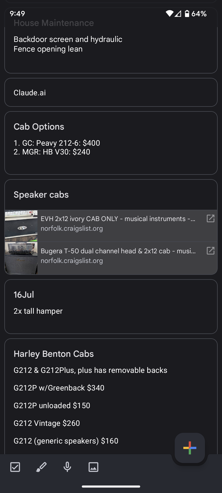

# CF 401: Java // Reading Notes

## Class 28: RecyclerView

## Readings

[RecyclerView for displaying lists of data](https://developer.android.com/guide/topics/ui/layout/recyclerview#java)

### Questions

1. What makes a RecyclerView dynamic?
2. Share a screenshot of a recycler view in an application you use!

### Answers

1. It's dynamic because it can display a large set of data efficiently by recycling views that are no longer visible to the user. It also allows for 
dynamic changes to the data set, such as adding or removing items, and supports different types of layouts and animations.

2. 

